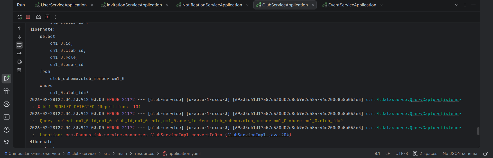

[](README.tr.md)
[](README.md)
# 🕵️‍♂️ N+1 Hunter - Spring Boot Starter

**Catch N+1 performance problems at runtime, right in your local development environment.**

## 🛑 The Problem
The N+1 select problem is the most common performance issue in projects using ORM (Hibernate/JPA). While everything runs fast locally, the system slows down in production as data grows.
*   `show-sql` logs are hard to read and noisy.
*   Even if you know there is an error, finding the answer to "Which line is causing this?" is like looking for a needle in a haystack.

## 💡 The Solution
**N+1 Hunter** is a **Zero Config** library that starts working the moment you add it to your project. It listens to database traffic and captures recurring queries. When an error occurs, it uses the Java `StackWalker` API to tell you the **exact problematic code line**.

---

## 🚀 Installation

### 1. Add Dependency
First, install the project to your local maven repository: `mvn clean install`

Then add it to your own project:

**Maven:**
```xml
<dependency>
    <groupId>com.nplus1-hunter</groupId>
    <artifactId>Nplus1-Hunter</artifactId>
    <version>0.0.1-SNAPSHOT</version>
</dependency>
```
### Gradle

```groovy
implementation 'com.nplus1-hunter:Nplus1-Hunter:0.0.1-SNAPSHOT'
```
---

## ⚙️ Configuration (Optional)

The default settings are sufficient for most projects.  
If you want to change them, use `application.yml` or `application.properties`:

```yaml
nplus1:
  enabled: true             # Enable/Disable the library (Default: true)
  threshold: 5              # How many repetitions before warning? (Default: 5)
  error-level: LOG          # LOG (Only warns) or EXCEPTION (Crashes app) (Default: LOG)
```

```properties
# Enable/Disable the library (Default: true)
nplus1.enabled=false

# How many repetitions before warning? (Default: 5)
nplus1.threshold=3

# LOG (Only warns) or EXCEPTION (Crashes app) (Default: LOG)
nplus1.error-level=EXCEPTION
```

---

## ▶️ Run

No additional configuration is required.

Start your application and send a request to any endpoint.  
If an N+1 problem occurs, you will see the corresponding warning in the console.

---

## 📸 Sample Output

When an N+1 error is caught, it looks like this in the console:




---

## 🛠 Technical Details

- **Proxy** → Listens to the Spring `DataSource` object
- **ThreadLocal** → Keeps an isolated counter for each HTTP request
- **StackWalker** → Analyzes the Java stack trace, filters framework code, and finds your code