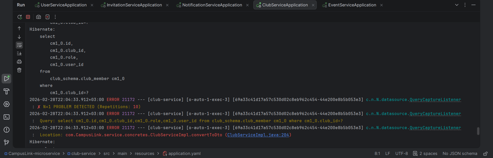

[](README.tr.md)
[](README.md)
# 🕵️‍♂️ N+1 Hunter - Spring Boot Starter

**N+1 performans sorunlarını production ortamında değil, geliştirme aşamasında yakalayın.**

---

## 🛑 Problem Nedir?

N+1 select problemi, ORM (Hibernate/JPA) kullanan projelerde en sık karşılaşılan performans sorunudur.  
Local ortamda her şey hızlı çalışırken, veri arttıkça production ortamında sistem ciddi şekilde yavaşlar.

- `show-sql` loglarını okumak zordur ve karmaşıktır.
- Hata olduğunu bilseniz bile “Hangi satır buna sebep oluyor?” sorusunun cevabını bulmak samanlıkta iğne aramak gibidir.

---

## 💡 Çözüm

**N+1 Hunter**, projenize eklediğiniz anda çalışmaya başlayan (**Zero Config**) bir kütüphanedir.

- Veritabanı trafiğini dinler
- Tekrar eden sorguları yakalar
- Hata anında Java `StackWalker` API’sini kullanır
- Size **tam olarak sorunlu kod satırını** gösterir

Ekstra yapılandırma gerektirmez.

---

## 🚀 Kurulum

### 1. Bağımlılığı Ekleyin

Önce projeyi local maven deponuza kurun:

```bash
mvn clean install
```

Ardından kendi projenize ekleyin.

### Maven

```xml
<dependency>
    <groupId>com.nplus1-hunter</groupId>
    <artifactId>Nplus1-Hunter</artifactId>
    <version>0.0.1-SNAPSHOT</version>
</dependency>
```

### Gradle

```groovy
implementation 'com.nplus1-hunter:Nplus1-Hunter:0.0.1-SNAPSHOT'
```

---

## ⚙️ Ayarlar (Opsiyonel)

Varsayılan ayarlar çoğu proje için yeterlidir.  
Değiştirmek isterseniz `application.yml` veya `application.properties` dosyasını kullanabilirsiniz:

#### application.yml
```yaml
nplus1:
  enabled: true             # Kütüphaneyi aç/kapa (Varsayılan: true)
  threshold: 5              # Uyarı vermeden önce kaç tekrar? (Varsayılan: 3)
  error-level: LOG          # LOG (Sadece uyarır) veya EXCEPTION (Uygulamayı durdurur) (Varsayılan: LOG)
  log-interval: 20          # LOG modunda, her N. tekrarda bir log basar (Varsayılan: 1)
  ignore-packages:          # Stack trace analizinde yoksayılacak özel paketler
    - com.google.
    - com.acme.common.
```
#### application.properties
```properties
# Kütüphaneyi aç/kapa (Varsayılan: true)
nplus1.enabled=false

# Uyarı vermeden önce kaç tekrar? (Varsayılan: 5)
nplus1.threshold=3

# LOG veya EXCEPTION (Varsayılan: LOG)
nplus1.error-level=EXCEPTION

# Her 20. tekrarda bir log bas (Varsayılan: 10)
# Sadece error-level=LOG ise geçerlidir.
nplus1.log-interval=20

# Yoksayılacak özel paketler
nplus1.ignore-packages[0]=com.google.
nplus1.ignore-packages[1]=io.micrometer.
```
---

## ▶️ Çalıştırma

Ekstra bir yapılandırma yapmanıza gerek yoktur.

Uygulamanızı başlatın ve herhangi bir endpoint’e istek atın.  
Eğer N+1 problemi oluşursa, ilgili uyarıyı console üzerinde göreceksiniz.

---

## 📸 Örnek Çıktı

Bir N+1 hatası yakalandığında konsolda şu şekilde görünür:





---

## 🛠 Teknik Detaylar

- **Proxy** → Spring `DataSource` nesnesini dinler
- **ThreadLocal** → Her HTTP isteği için izole sayaç tutar
- **StackWalker** → Java stack trace’ini analiz eder, framework kodlarını filtreler ve sizin kodunuzu bulur  
